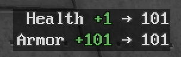

# Status Widget

Status Widget is an add-on for GZDoom. It displays changes of health, armor,
ammo, and more.

This mod is a part of [m8f's toolbox](https://mmaulwurff.github.io/pages/toolbox).

## Features

- plain UI;
- customizable;
- lots of things to track - health, ammo, inventory items, armor, weapons, keys,
  oxygen, powerups.
- max value highlighting for ammo, inventory items, health, armor.
- extendable - see API.

## API

Status Widget is extendable - you can track any kind of thing. To do this,
create a class that inherits sw_Tracker. See `zscript/status-widget/tracker.zs`
for API documentation and `sw_InventoryTracker` for an example.

## Acknowledgments

- Thanks to Ac!d for bug reports.
- Thanks to namsan for feature suggestions.
- Thanks to Spaceman333 for feature suggestions.
- Thanks to mamaluigisbagel for feature suggestions and bug reports.

## Known Issues

Messages can be not correct right after enabling message types. They become
correct after the incorrect messages disappear.

## Info

Author: m8f (mmaulwurff@gmail.com)

License: GPLv3 (see copying.txt).

[Source](https://github.com/mmaulwurff/status-widget/)
